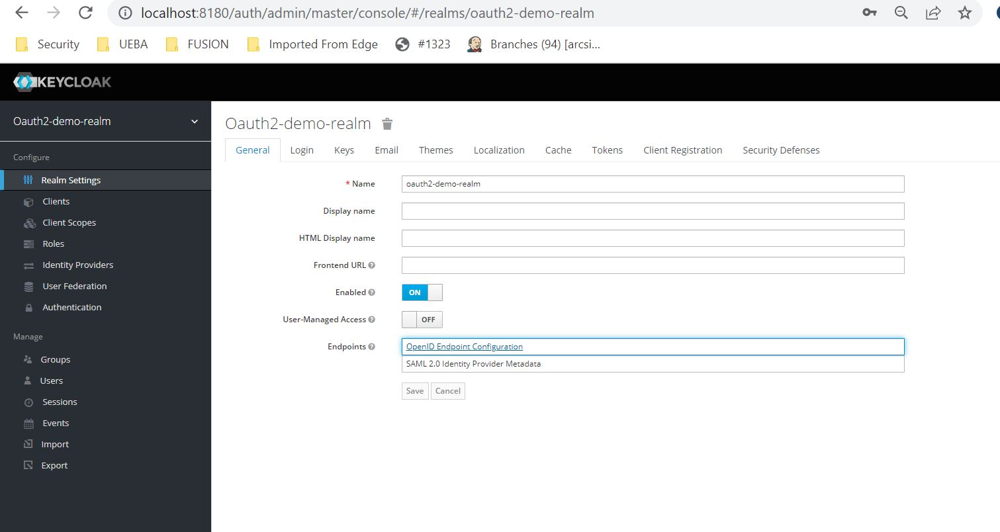

### Spring Security oAuth2

The goal is used to create a web application which support SSO with multiple clients.

### oAUth 2.0:
Industry standard protocol for authorization.
 More info at <a href="https://oauth.net/2/">oAuth2.0</a>

UseCase: Login to facebook and get the user information 

<a href="https://docs.spring.io/spring-security/site/docs/5.0.7.RELEASE/reference/html/oauth2login-advanced.html">Spring advacned OAuth2 Configurations</a>

### Keyclock
Configured keyclock as SSO provider

Step1: Download standalone keyclock into your desktop
<a href="https://www.keycloak.org/downloads"> keyclock downloads</a>

Step2: Extract zip file and goto bin folder in command prompt then run standalone with command in 
> standalone.bat -Djboss.http.port=8180

Step3: Create Admin user and click on "Administration Console"
Step 4: Add New Realm
Step 5:  Under the new Realm Create a Client and add configurations such as Valid redirect url
Step 6: Under the Client Create a couple of users and set the password in Credentials tab
Step 7: Clone this project and edit the application.yaml with oAuth2 client information
To Get the issuerUri, authorizationUri from Keyclock, goto Realm Setting -> OpenID Endpoint Configuration
